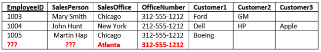
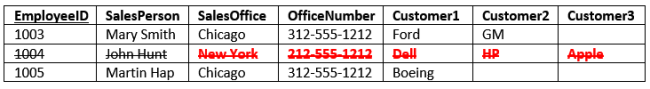

# Database

## 1. Chuẩn hóa cơ sở dữ liệu (Database Normalization)
### 1.1. Định nghĩa
> Chuẩn hóa cơ sở dữ liệu là tiến trình tổ chức cơ sở dữ liệu thành các bảng và các cột theo 1 số quy tắc để mang lại một số lợi ích.

### 1.2. Tại sao cần chuẩn hóa
#### Chuẩn hóa CSDL sẽ giúp:
* Giảm thiểu sự trùng lặp dữ liệu (tiết kiệm bộ nhớ)
* Giảm thiểu và tránh các vấn đề nảy sinh khi chỉnh sửa dữ liệu
* Tạo sự đơn giản khi truy vấn
#### Xét ví dụ CSDL không được chuẩn hóa để nhận ra những vấn đề


*Khóa chính là EmployeeID*
**Nhận xét: Bảng này phục vụ cho 3 mục đích:**

* Định danh nhân viên kinh doanh
* Chứa thông tin miêu tả văn phòng
* Liệt kê các khách hàng của họ

**Thông thường khi thiết kế CSDL tốt thì mỗi bảng chỉ phục vụ cho 1 mục đích**

#### Các vấn đề gặp phải với bảng SalesStaff trên:
* Vấn đề khi mở rộng dữ liệu
    * Nếu nhân viên có nhiều khách hàng hơn thì ta cần mở rộng CSDL theo chiều ngang (tăng số lượng cột). Điều này khó hơn mở rộng theo chiều dọc (thêm số bản ghi) bởi vì ta phải thay đổi cấu trúc bảng
* Trùng lặp (dư thừa) dữ liệu
    * Với mỗi cặp văn phòng và số điện thoại văn phòng được lưu nhiều lần
    * Sự trùng lặp này khiến tốn bộ nhớ, giảm hiệu năng và dẫn đến các vấn đề bên dưới
* Vấn đề khi thêm bản ghi
    * Khi thêm 1 văn phòng mới thì ta không thêm được vào bảng SalesStaff do chứa có thông tin khóa chính EmployeeID. Nếu có bảng chỉ phục vụ cho mục đích quản lý văn phòng thì ta dễ dàng thêm được bản ghi mới
    
* Vấn đề khi cập nhật bản ghi
    * Khi cập nhật số điện thoại cho 1 văn phòng thì do trùng lặp dữ liệu nên ta cần cập nhật trên nhiều bản ghi (tốn thời gian, nếu 1 trong số sự cập nhật không thành công thì CSDL trờ nên không thống nhất)
    
* Vấn đề khi xóa bản ghi
    * Khi xóa thông tin về 1 nhân viên (John - 1004) thì dẫn đến việc xóa mất thông tin về văn phòng New York)
    
* Vấn đề khi truy vấn
    * Khi cần tìm những nhân viên có khách hàng tên là Ford thì ta cần truy vấn như sau
    ```
    Select SalesPerson
    From SalesStaff
    Where Customer1 = 'Ford' Or
          Customer2 = 'Ford' Or
          Customer3 = 'Ford'
    ```
    Truy vấn sẽ trở nên *dài* khi số khách hàng tăng
    * Khi cần sắp xếp các bản ghi theo cột khách hàng thì rất khó để truy vấn


### 1.3. Các dạng chuẩn
#### Các dạng chuẩn thường gặp và điều kiện phải thỏa mãn
* Chuẩn 1NF:
    * Mỗi cột chứa giá trị nguyên tử (atomic value)
    * Không có các cột biểu diễn các thông tin tương tự nhau
* Chuẩn 2NF:
    * CSDL thỏa mãn dạng chuẩn 1NF
    * Mọi cột trong 1 bảng phải phụ thuộc toàn phần vào khóa chính (không được phụ thuộc vào chỉ một số cột trong khóa chính)
* Chuẩn 3NF:
    * CSDL thỏa mãn dạng chuẩn 2NF
    * Mọi cột trong 1 bảng không được phụ thuộc bắc cầu vào khóa chính
* Chuẩn BoyceCodd BCNF:
* Chuẩn 4NF:

## 2. Một số mệnh đề cơ bản
### Cấu trúc truy vấn tổng quát
```
    Select table1.column2, SUM(table1.column1), COUNT(table2.column1)
    From table1
    Inner Join table2
    On table1.column2 = table2.column2
    Where table1.column3 > 10
    Group by table1.column2
    Having COUNT(table2.column1) > 5
    Order by table1.column2
```
### Một số từ khóa hay dùng
* And, Or, In
* Between
* Limit (hoặc Top): giới hạn số bản ghi tối đa được trả về
* Is NULL
* Like: truy vấn dữ liệu thỏa mãn 1 khuôn mẫu (pattern)
* Union, Intersect, Minus: toán tử tập hợp
* Các loại Join
    * Inner Join
    ```
    Select *
    From table1
    Inner Join table2
    On table1.column1 = table2.column1
    ```
    * Left Join
    * Right join
    * Full Join
    * Cross Join
    * Self Join
* Cập nhật dữ liệu
    * Thêm bản ghi
    ```
    Insert Into table1
    Values (v1, v2, v3)
    ```
    * Cập nhật bản ghi
    ```
    Update table1
    Set column1 = value1, column2 = value2
    Where condition
    ```
    * Xóa bản ghi
    ```
    Delete From table1
    Where condition
    ```
* Quản lý CSDL, bảng
    * Create/Drop database (table)
    * Alter, Truncate table

* Constraint
    * Primary key
    * Foreign key
    * Unique
    * Check
    * Not Null


## 3. View
> View có thể coi như *bảng ảo*, khá giống bảng (gồm các hàng và cột), được xây dựng dựa trên 1 hoặc 1 vài bảng (hoặc view) khác

* Đặc điểm:
    * Bản thân view không chứa dữ liệu
    * Khi dữ liệu nền của các bảng cấu thành nên view được cập nhật thì khi truy vấn từ view ta sẽ thấy được sự thay đổi
* Ưu điểm:
    * Tạo sự đơn giản khi truy vấn: View sẽ che giấu đi sự phức tạp của view khỏi end user. Khi truy vấn ta không biết rằng view được cấu thành nên bởi nhiều câu lệnh.
    * View không chứa dữ liệu nên dùng view sẽ tiết kiệm được bộ nhớ hơn việc tạo 1 bảng
    * Tăng tính bảo mật: Chỉ có những user có quyền được cấp, mới có thể truy vấn đối với các cột dữ liệu trong View. Cơ chế này giúp ta chỉ *phơi bày* những cột dữ liệu nhất định đối với những user nhất định
* Nhược điểm:
    * Truy vấn trên view có thể chậm hơn so với truy vấn trên bảng gốc (nhất là view được tạo bởi view khác)


## 4. Stored Procedure
> Stored Procedure là một đoạn lệnh SQL được lưu trữ trong hệ quản trị CSDL (chức năng giống hàm trong lập trình). SP được gọi bởi lệnh SQL, trigger, SP khác hoặc bởi phía ứng dụng Java, PHP,...

* Ưu điểm:
    * Tăng hiệu năng: Sau khi được tạo thì SP được compiled và lưu trữ trong DBMS. Nếu SP được gọi nhiều lần thì thời gian sẽ giảm so với việc gọi nhiều lần đoạn code bên trong SP
    * Giảm lưu lượng đường truyền giữa phía ứng dụng client và phía server bởi vì thay vì viết câu SQL dài thì ta chỉ cần gọi SP
    * Thêm tính bảo mật: admin có thể cấp quyền được gọi SP đối với những user nhất định (mà không cần can thiệp vào quyền trên các bảng)

* Nhược điểm:
    * Tốn bộ nhớ
    * Không phù hợp để phát triển các thủ tục phức tạp (việc này vốn dĩ của bên lập trình phía client)

## 5. Trigger
> Trigger là 1 tập các câu lệnh SQL được lưu trong DBMS. Một Trigger được thực hiện khi 1 sự kiện gắn liền với 1 bảng xảy ra (insert, update, delete)

* Đặc điểm
    * Trigger có thể coi như 1 stored procedure đặc biệt. Điểm khác biệt là trigger được gọi 1 cách tự động, còn SP được gọi 1 cách tường minh
    * Trigger được gọi tự động *trước* hoặc *sau* khi sự kiện xảy ra (được quy định khi tạo trigger)
    * Constraint kiểm tra ràng buộc chỉ trên 1 bảng, còn trigger có thể tác động đến bảng khác. Ví dụ khi thêm hóa đơn của 1 khách hàng có giá trị trên 1 triệu, thì cập nhật tăng mức độ ưu đãi của khách hàng trên bảng ưu đãi
* Ưu điểm
    * Giúp kiểm tra tính toàn vẹn của dữ liệu
    * Ngăn ngừa 1 số lỗi có thể khi cập nhật dữ liệu
* Nhược điểm
    * Trigger chỉ cung cấp sự xác thực, kiểm tra đơn giản
    * Do được kích hoạt tự động khi có sự kiện xảy ra nên nhiều khi sau khi thực hiện cập nhật dữ liệu, ta nhận thấy nhiều kết quả khó hiểu (do ta chỉ nhìn vào các đoạn lệnh tường minh, mà quên đi có các trigger đã được kích hoạt)
    * Nếu lập trình kém thì có thể tạo ra các trigger lặp không dừng (trigger1 kích hoạt khi bảng A cập nhật, trigger1 sẽ cập nhật bảng B, khi đó trigger2 được kích hoạt, thực hiện cập nhật bảng A,...)

## 6. Transaction
> Một Transaction (giao dịch) gồm một tập các thao tác có đặc điểm là nếu không có lỗi thì tất cả các thao tác được thực hiện thành công, ngược lại nếu có một lỗi trong quá trình thực hiện xảy ra thì hủy bỏ mọi kết quả của các thao tác, quay về trạng thái trước khi thực hiện transaction

### Ví dụ cần sử dụng transaction
* Khi thực hiện chuyển tiền từ tài khoản A sang tài khoản B thì ta cần thực hiện 2 thao tác
    * Giảm số tiền trong tài khoản A
    * Tăng số tiền trong tài khoản B
* Nếu chỉ 1 trong 2 thao tác trên được thực hiện thành công thì dữ liệu bị mất tính toàn vẹn. Do đó ta cần quy định 1 transaction gồm 2 thao tác trên. Khi đó hoặc là cả 2 thao tác được thực hiện thành công hoặc là không có thao tác nào được thực hiện
    
### Các từ khóa sử dụng
* Start Transaction
* Savepoint
* Rollback to
* Commit

## 7. Index
> Index (chỉ mục) là cấu trúc cho phép truy vấn nhanh dữ liệu trong CSDL. Index có thể tạo trên 1 cột hoặc nhóm các cột, sử dụng cây BBST và danh sách kết nối đôi để duy trì thứ tự giá trị của các bản ghi tương ứng với các cột index.

* Ưu điểm: giúp tăng hiệu năng truy vấn
* Nhược điểm: tốn bộ nhớ, phải cập nhật index mỗi khi cập nhật cột index của các bản ghi
* Trường hợp nên sử dụng index:
    * Nên đánh index trên các cột có lượng lớn truy vấn chỉ **đọc**, tốc độ cải thiện khi các cột được index xuất hiện trong mệnh đề Where, Order by, Group by, và khi Join các bảng mà cột chung là cột index (ngoài ra, nên đánh index trên Primary và Foregin key).
* Trường hợp không nên sử dụng index:
    * Khi bảng chứa ít bản ghi, hoặc hầu hết các truy vấn đều lấy ra hầu hết các bản ghi trong bảng
    * Khi thao tác trên cột index chủ yếu là Insert, Update, Delete
    * Không đánh index trên cột chứa nhiều giá trị trùng nhau (ví dụ như nhiều giá trị NULL)
* Phân biệt **clustered index** và **non clustered index**
    * **Clustered index**
        * Ví dụ minh họa: CI là chỉ mục trong quyển danh bạ điện thoại. Khi tra cứu tên theo abc thì ta có ngay nội dung (thông tin khác của user) khi kết thúc quá trình tìm k
        * Mỗi bảng có tối đa 1 clustered index
        * Clustered index sẽ quy định thứ tự mà các bản ghi được lưu trên ổ cứng. Vì thế mỗi bảng chỉ có tối đa 1 CI (thứ tự lưu trữ vật lý chỉ có một, còn thứ tự logic thì có thể có nhiều)
        * Khi tìm kiếm đến lá trong quá trình tìm theo index thì dữ liệu thật sự được lưu ngay ở lá
    * **Non clustered index**
        * Ví dụ minh họa: NCI là chỉ mục ở đầu sách. Khi kết thúc quá trình tìm kiếm theo index, ta thu được vị trí (số trang) chứa dữ liệu cần tìm. Sau đó cần thực hiện lật sách đúng số trang để lấy ra đầy đủ dữ liệu.
        * Mỗi bảng có thể có nhiều non clustered index
        * Khi tìm kiếm đến lá index thì ta mới tìm được địa chỉ vùng nhớ thật sự, lúc này cần thực hiện thêm thao tác lấy dữ liệu từ vùng nhớ đó. Do đó truy vấn sẽ chậm hơn clustered index

## Tài liệu tham khảo
* [Database Normalization Explained in Simple English](https://www.essentialsql.com/get-ready-to-learn-sql-database-normalization-explained-in-simple-english/) 
* [Learn about the First Normal Form and Database Design](https://www.essentialsql.com/get-ready-to-learn-sql-8-database-first-normal-form-explained-in-simple-english/)
* [Database Second Normal Form Explained in Simple English](https://www.essentialsql.com/get-ready-to-learn-sql-10-database-second-normal-form-explained-in-simple-english/)
* [Database Third Normal Form Explained in Simple English](https://www.essentialsql.com/get-ready-to-learn-sql-11-database-third-normal-form-explained-in-simple-english/)
* [Basic MySQL Tutorial](http://www.mysqltutorial.org/basic-mysql-tutorial.aspx)
* [MySQL Stored Procedure](http://www.mysqltutorial.org/mysql-stored-procedure-tutorial.aspx)
* [SQL Performance Tuning using Indexes](https://odetocode.com/articles/237.aspx)
* [Clustered vs Nonclustered: What Index Is Right For My Data?](https://hackernoon.com/clustered-vs-nonclustered-what-index-is-right-for-my-data-717b329d042c) 