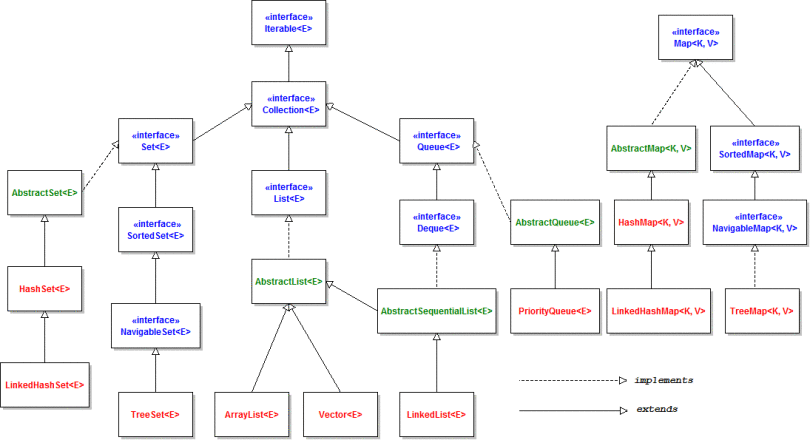
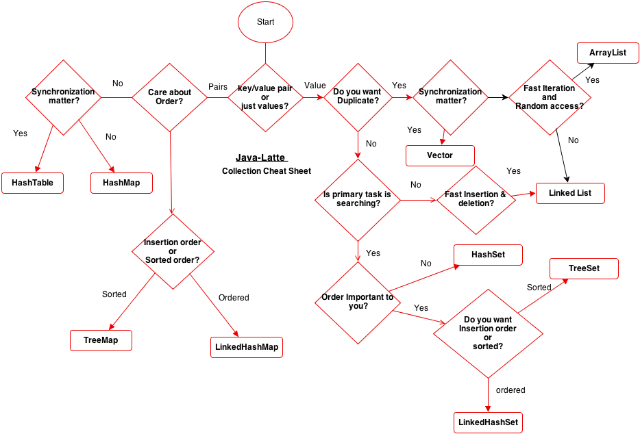
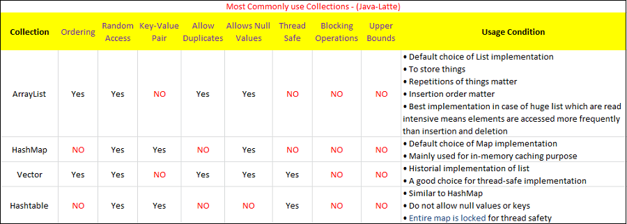
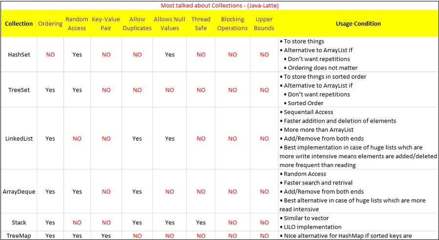
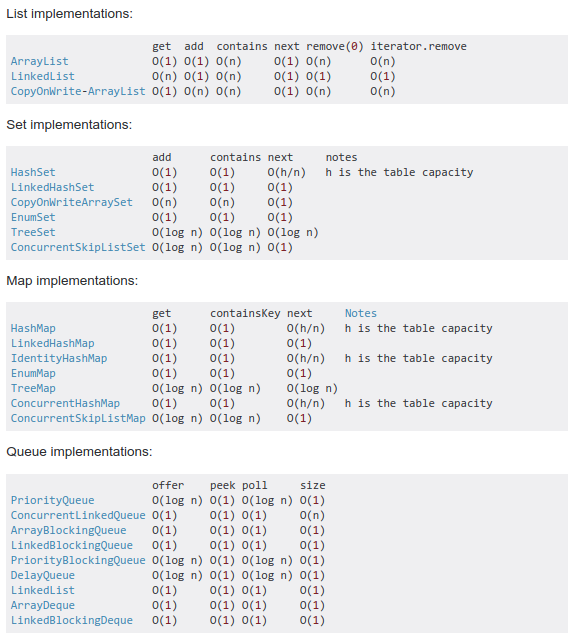

# Java Core


# 1. Concurrency
## 1.1. Khái niệm
> *Concurrency là khả năng chạy nhiều chương trình hoặc nhiều đoạn chương trình song song*

## 1.2. Tổng quan lập trình song song
### Tại sao cần thực hiện song song ?
* Giảm thời gian thực hiện
* Tận dụng được tối đa tài nguyên máy tính (Mặc định chương trình chỉ được chạy trên 1 thread, khi đó không sử dụng được các core khác trong máy tính nhiều core).
### Các vấn đề chính
* Process (tiến trình) và Thread (luồng)
    * Process
        * Mỗi process chạy độc lập với nhau
        * Các process không chia sẻ dữ liệu trực tiếp (mỗi process có không gian địa chỉ vùng nhớ riêng biệt do hệ điều hành quản lý, cấp phát). Vì vậy cần có *cơ chế truyền thông* giữa các process để trao đổi dữ liệu
    * Thread
        * Các thread của cùng 1 process có thể chia sẻ trực tiếp dữ liệu (có chung không gian địa chỉ vùng nhớ), không cần truyền thông trao đổi dữ liệu, nhưng cần xử lý vấn đề *tranh chấp tài nguyên*
        * **Ứng dụng Java sử dụng 1 process. Nhiệm vụ của lập trình viên là khai thác được việc lập trình song song ở mức thread !**
* Tranh chấp tài nguyên giữa các thread
    * Khi 1 vùng nhớ được đọc - ghi bởi nhiều thread, cần đảm bảo mỗi thread luôn đọc nội dung mới nhất của vùng nhớ
    * Khi 1 thread đang thực hiện ghi vào vùng nhớ thì các thread khác không được đọc, ghi. *Cần tránh trường hợp deadlock - khi mà mỗi thread nắm giữ 1 tài nguyên mà để thực hiện tiếp công việc thì lại cần tài nguyên mà thread khác đang nắm giữ*
* Cần có cơ chế truyền thông giữa các process
* **Chú ý: Không phải cứ sử dụng thật nhiều thread là tối ưu. Số thread phù hợp được quyết định dựa trên đặc điểm chương trình và tài nguyên hiện có**
## 1.3. Mục đích sử dụng package java.util.concurrent

### So sánh với các giải pháp hiện có
* Trước đây để lập trình song song trong Java ta sử dụng Thread, Runnable.
    * Sơ lược về cách sử dụng Thread và Runnable
        * Để mô tả các task cần thực hiện song song: ta implement interface Runnable, override Run method (nội dung công việc được cài đặt trong hàm Run).
        * Khởi tạo 1 đối tượng Thread với constructor nhận tham số là 1 đối tượng Runnable. Sau đó gọi hàm start của thread để thực hiện công việc
```java
		Runnable runnable = new Runnable() {
			@Override
			public void run() {
				try {
					// do something
					String threadName = Thread.currentThread().getName();
					System.out.println("Thread name : " + threadName);
					TimeUnit.SECONDS.sleep(1);
					System.out.println("Thread name : " + threadName);
				} catch (InterruptedException e) {
					e.printStackTrace();
				}
			}
		};

		Thread thread = new Thread(runnable);
		thread.start();
```
    
   * Nhược điểm của Thread
       * Khó quản lý số lượng thread. Việc sử dụng quá nhiều thread sẽ làm giảm hiệu năng, có nguy cơ tràn bộ nhớ.
###*Concurrency API ra đời với nhiều tính năng hỗ trợ lập trình song song*

## 1.4. Tổng quan kiến trúc
### 1.4.1. Executor
* Class Executors: Có thể coi như 1 nhà máy, cung cấp phương thức để tạo ra các loại Executor Service khác nhau
* Class Executor Service: quản lý thread pool. Các task cần thực hiện song song sẽ được submit (hoặc execute) vào service này. Ta có thể hiểu rằng service sẽ chứa 1 queue gồm các task cần thực hiện, service sẽ dùng các thread (với số lượng đã quy định khi tạo service) để thực hiện các task, và luôn *lắng nghe* xem queue còn task nào không để thực hiện.
```java
// Create service manage a thread pool of given size
ExecutorService executor = Executors.newFixedThreadPool(numThread);
```
* Để đẩy 1 task vào queue thì có thể dùng 2 cách:
    * Gọi hàm executor.execute(task) (task có kiểu Runnable hoặc Callable). Cách này được sử dụng khi **không** quan tâm đến kết quả trả về của task. Hàm này có kiểu trả về là void.
    * Gọi hàm executor.submit(task) (task có kiểu Runnable hoặc Callable). Cách này được sử dụng khi quan tâm đến kết quả trả về của task. Hàm này sẽ trả về đối tượng thuộc kiểu Future. Với đối tượng Future ta sẽ biết được task đã hoàn thành hay chưa, kết quả trả về là bao nhiêu.
* Để dừng service thì cần dừng một cách *tường minh* (nếu không thì service luôn chạy và lắng nghe queue)
    * executor.shutdown(): đợi các task đang chạy được hoàn thành thì sẽ dừng service.
    * executor.shutdownNow(): sẽ ngắt các task đang chạy và dừng service ngay lập tức.
    * executor.awaitTermination(time, TimeUnit): dùng với shutdown, để quy định thời gian tối đa chờ đợi các task hoàn thành.
* Sự khác nhau giữa Runnable và Callable
    * Runnable: Kiểu trả về sau khi task được hoàn thành là void. Để implement thì cần cài đặt hàm run.
    * Callable: Có kiểu trả về sau khi task được hoàn thành. Để implement thì cần cài đặt hàm call.
* Để thực hiện 1 danh sách các task thì dùng hàm invokeAll(), invokeAny().
    
### 1.4.2. Callable và Future
#### Hàm submit sẽ không đợi (block main thread) các task được thực hiện xong, do đó ta cần sử dụng đối tượng Future để kiểm tra kết quả
* Các hàm chính của đối tượng Future:
    * get(): đợi (block) đến khi task được hoàn thành và trả về kết quả được quy định trong Callabel. Hàm này có thể nhận thêm tham số quy định thời gian tối đa để chờ (cần cẩn thận trường hợp khi mà task có thể không bao giờ kết thúc).
    * isDone(): kiểm tra task đã hoàn thành chưa (hàm trả về kết quả boolean luôn mà không block thread).
    * cancel(boolean): hủy task tương ứng

### 1.4.3. Scheduled Executor
#### Để thực hiện các task một cách định kì nhiều lần, ta cần một đối tượng Scheduled Executor
* Ví dụ sau cài đặt lập lịch 1 task sẽ được thực hiện sau thời gian delay = 3 giây.
```java
ScheduledExecutorService executor = Executors.newScheduledThreadPool(1);

Runnable task = () -> System.out.println("Scheduling: " + System.nanoTime());
ScheduledFuture<?> future = executor.schedule(task, 3, TimeUnit.SECONDS);

TimeUnit.MILLISECONDS.sleep(1337);

long remainingDelay = future.getDelay(TimeUnit.MILLISECONDS);
System.out.printf("Remaining Delay: %sms", remainingDelay);
```
* Hàm schedule() để lập lịch. Đối tượng trả về thuộc kiểu ScheduledFuture
* Hàm getDelay(): trả về thời gian delay còn lại
* Để lập lịch định kì thì sử dụng 2 cách:
    * executor.**scheduleAtFixedRate**(task, initialDelay, period, TimeUnit.SECONDS): thực hiện task định kì cứ *period* một lần (VD cứ 5 giây 1 lần). Nếu task thực hiện mất 8 giây thì lịch thực hiện là: 0,5,10,... (không quan tâm thời gian thực hiện của task) (với initialDelay = 0, period = 5, task thực hiện mất 8 giây)
    * executor.**scheduleWithFixedDelay**(task, initialDelay, period, TimeUnit.SECONDS): cũng tương tự hàm scheduleAtFixedRate, nhưng *period* sẽ được tính là thời gian tính từ lần kết thúc của lần thực hiện trước cho đến khi bắt đầu thực hiện lần tiếp theo. VD lịch thực hiện là 0,13,26,... (với initialDelay = 0, period = 5, task thực hiện mất 8 giây)

### 1.4.4. Synchronized, Lock, Semaphore
#### 3 chức năng trên sẽ đảm bảo các đoạn code chỉ được thực hiện bởi 1 thread tại 1 thời điểm
* Synchronized: từ khóa này quy định 1 hàm, hoặc 1 đoạn code chỉ được thưc hiện tối đa bởi 1 thread tại 1 thời điểm
* Lock: Lock đem lại nhiều tính năng và sự mềm dẻo so với synchronized. Có nhiều loại lock (VD có ReadWriteLock cho phép nhiều thread cùng nắm read lock, nhưng chỉ có 1 lock được nắm write lock). Ý tưởng chung là: đầu đoạn code thì gọi lock (nếu đã có thread khác nắm lock thì thread đang gọi sẽ phải đợi), cuối đoạn code thì giải phóng lock. Ngoài ra thì có thể *try lock*, nhằm thăm dò xem có thread khác nào hiện đang nắm giữ lock hay không, hàm này sẽ trả về kết quả ngay (không block thread) để cho thread có thể thực hiện công việc khác, tránh lãng phí thời gian đợi
* Semaphore: có chức năng giới hạn số thread tối đa có thể cùng lúc thực hiện 1 đoạn code
### 1.4.5. Atomic
#### Package java.concurrent.atomic chứa nhiều class hỗ trợ toán tử atomic
*Toán tử atomic là toán tử có thể thực hiện 1 cách an toàn (đúng đắn) bởi nhiều thread cùng lúc mà không cần lập trình viên tường minh giải quyết vấn đề tranh chấp dữ liệu (thư viện đã cài đặt sẵn)*
* Ví dụ class AtomicInteger với phương thức incrementAndGet(). Hàm này có chức năng giống phép ++i, nhưng đảm bảo kết quả đúng đắn khi thực hiện song song
```java
AtomicInteger atomicInt = new AtomicInteger(0);
int newValue = atomicInt.incrementAndGet();
```

### 1.4.6. ConcurrentMap

## Tài liệu tham khảo
* [Java concurrency](http://www.vogella.com/tutorials/JavaConcurrency/article.html) 
* [Java 8 Concurrency Tutorial: Threads and Executors (Part 1)](http://winterbe.com/posts/2015/04/07/java8-concurrency-tutorial-thread-executor-examples/) 
* [Java 8 Concurrency Tutorial: Synchronization and Locks (Part 2)](http://winterbe.com/posts/2015/04/30/java8-concurrency-tutorial-synchronized-locks-examples/) 
* [Java 8 Concurrency Tutorial: Atomic Variables and ConcurrentMap (Part 3)](http://winterbe.com/posts/2015/05/22/java8-concurrency-tutorial-atomic-concurrent-map-examples/) 

# 2. Collection

## Toàn cảnh sơ đồ phân cấp 1 số collection quan trọng
 


## Các collection quan trọng
* ArrayList, LinkedList, Stack
* PriorityQueue
* HashMap, TreeMap, ConcurrentHashMap
* HashSet, TreeSet

## Một cách để lựa chọn collection phù hợp


## Bảng tổng kết một số đặc điểm của các collection

====================
 


## Tổng kết độ phức tạp của 1 số collection


## Một số vấn đề cần hiểu
* Trường hợp sử dụng, đặc điểm, độ phức tạp của một số thao tác chính
* Tìm hiểu Comparator, Comparable, HashCode, Equal
* Các Collection an toàn khi sử dụng đồng thời bởi nhiều thread

## Tài liệu tham khảo
* [Don't know which map/collection to use?](http://java-latte.blogspot.com/2013/06/dont-know-which-mapcollection-to-use.html) 
* [Collections in Java – Tutorial](https://www.journaldev.com/1260/collections-in-java-tutorial) 
* [Java Collections – Performance (Time Complexity)](http://infotechgems.blogspot.com/2011/11/java-collections-performance-time.html) 
* [Collections](http://cs.lmu.edu/~ray/notes/collections/) 
* [Java Collections Tutorial](http://tutorials.jenkov.com/java-collections/index.html) 